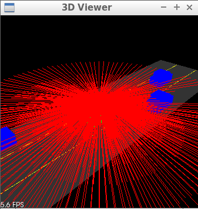
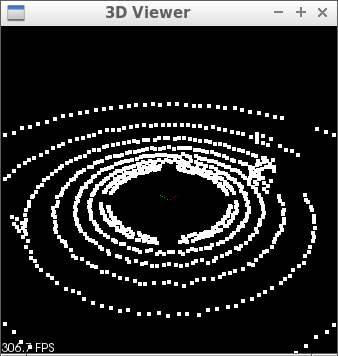

# **Lidar Obstacle Detection** 
## Project goal

Obstacles detection by performing Point Cloud Segmentation and Clustering Obstacles using Lidar sensor and Point Cloud Library (PCL).

## Project steps
Prospective final output


#### Completed steps

1. Highway scence intializing  (Ego-vehicle in green) using _3D Viewer_


2. Rendering Lidar rays


3. Rendering resulting Point Cloud


4. Point Cloud segmentation


### Basic Build Instructions
#### Ubuntu 

```bash
$> sudo apt install libpcl-dev
$> cd ~
$> git clone https://github.com/AElkenawy/Sensor-Lidar.git
$> cd SFND_Lidar_Obstacle_Detection
$> mkdir build && cd build
$> cmake ..
$> make
$> ./environment
```

#### Windows 

http://www.pointclouds.org/downloads/windows.html

#### MAC

##### Install via Homebrew
1. install [homebrew](https://brew.sh/)
2. update homebrew 
	```bash
	$> brew update
	```
3. add  homebrew science [tap](https://docs.brew.sh/Taps) 
	```bash
	$> brew tap brewsci/science
	```
4. view pcl install options
	```bash
	$> brew options pcl
	```
5. install PCL 
	```bash
	$> brew install pcl
	```

#### Prebuilt Binaries via Universal Installer
http://www.pointclouds.org/downloads/macosx.html  
NOTE: very old version 

#### Build from Source

[PCL Source Github](https://github.com/PointCloudLibrary/pcl)

[PCL Mac Compilation Docs](http://www.pointclouds.org/documentation/tutorials/compiling_pcl_macosx.php)
