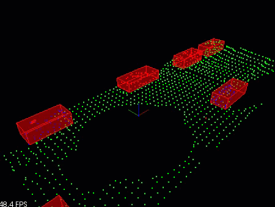
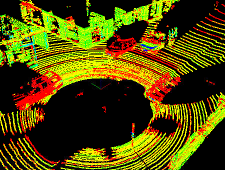
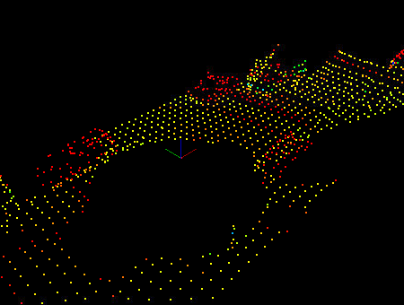
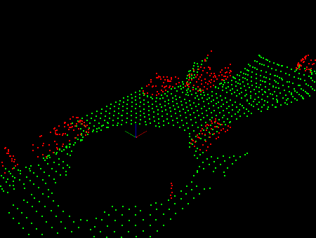
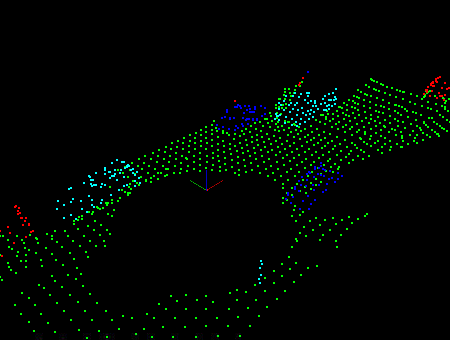
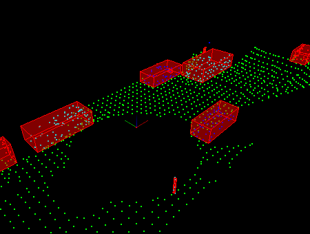

# **Lidar Obstacle Detection Project**

## Project goal
Detection of Obstacles utilizing a Point Cloud generated by the Lidar Sensor. A Stream of _.pcd_ files is fed into the pipeline which is performing Point Cloud Segmentation and Obstacles Clustering, manipulated by Point Cloud Library (PCL).



## Project steps

0. Raw scene of _XYZI_ Point Cloud `pointProcessorI->loadPcd`



1. Voxel Filtering `pointProcessorI->FilterCloud`
    _Downsampling_ the number of cloud points to increase processing efficiency for a particular Region Of Interest **ROI** 
   
    |Filter Hyperparameter|Value|
   |-----------|--------|
   |Resolution|0.5|
   |ROI start point (x,y,z)|(-8, -5, -3)|
   |ROI end point (x,y,z)|(23, 7, 0)|


    

2. Cloud Segmentation `pointProcessorI->SegmentPlane`
   
   Fitting a plane using the **RANSAC** Algorithm to the _Road points/Inliers_ (Green) to be separated from _Obstacles_ (Red)




3. Obstacles Clustering `pointProcessorI->completeCluster`
    * Points are inserted into a **KD-Tree** `tree->insert` to speed up the clustering/searching process
    * **Euclidean Clustering** is applied to the _Obstacles_ Point Cloud. Points are clustered due to their _proximity_ to each other `tree->search` within a _distance tolerance_

  

4. Bounding boxes 

  

5. Loading Point Cloud stream `pointProcessorI->loadPcd((*streamIterator).string())`
    Lidar sensor output as a sequence of _.pcd_ files located in _(sensors/data/pcd)_ are loaded then fed into the pipeline.

## Basic Build Instructions
### Ubuntu 

```bash
$> sudo apt install libpcl-dev
$> cd ~
$> git clone https://github.com/AElkenawy/Sensors-Lidar.git
$> mkdir build && cd build
$> cmake ..
$> make
$> ./environment
```

### Windows 

http://www.pointclouds.org/downloads/windows.html

### MAC

#### Install via Homebrew
1. install [homebrew](https://brew.sh/)
2. update homebrew 
	```bash
	$> brew update
	```
3. add  homebrew science [tap](https://docs.brew.sh/Taps) 
	```bash
	$> brew tap brewsci/science
	```
4. view pcl install options
	```bash
	$> brew options pcl
	```
5. install PCL 
	```bash
	$> brew install pcl
	```

#### Prebuilt Binaries via Universal Installer
http://www.pointclouds.org/downloads/macosx.html  
NOTE: very old version 

#### Build from Source

[PCL Source Github](https://github.com/PointCloudLibrary/pcl)

[PCL Mac Compilation Docs](http://www.pointclouds.org/documentation/tutorials/compiling_pcl_macosx.php)